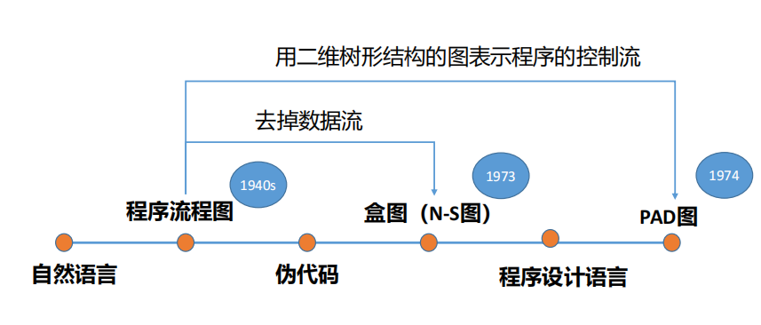

## 1.1用计算机求解问题与算法

`问题求解`(problem solving)是个大课题，它涉及归约、推断、决策、规划、常识推理、定理证明和相关过程的核心概念。

### 1.1.1用计算机求解问题的步骤

其中==算法设计==是解决问题的核心。

- 算法设计是指设计求解某一特定类型问题的一系列步骤，并且这些步骤是可以通过计算机的基本操作来实现的。
- 算法设计要同时结合**数据结构的设计**，简单说数据结构的设计就是选取**存储方式**。

算法分析

- 对算法的**某些特定输入**，估算该算法所需的**内存空间**和**运行时间**
- 建立衡量算法优劣的标准，用以比较同一类问题的不同算法。通常将**时间和空间的增长率**作为衡量的标准。

算法表示

- 方式有很多，如：程序流程图、盒图、PAD图和伪码（类似于算法设计语言）等

算法实现

- 使用哪种语言？有哪些变量，它们是什么类型？需要多少数组，规模有多大？用什么结构来组织数据？需要哪些子算法？
- 算法的实现方式，对**运算速度**和**所需内存容量**都有很大影响

程序调试

- 算法测试的实质是对算法应完成任务的实验证实，同时**确定算法的使用范围**。 
- **白盒测试**对算法的各个分支进行测试；**黑盒测试检验**对给定的输入是否有指定输出。

编制文档

- 目的是**让人了解所编写的算法**

### 1.1.2算法基本概念

- 问题包含若干**参数**，是决策人的**目的**，意识趋势的产物。 
- 对问题参数给出一组赋值，得到问题的一个具体**实例**。 
- 问题是**实例**的集合。 
- 实例的**目标**即所求的**解**，所有实例的解组成**解空间**。

算法是按部就班**解决**一个问题或完成某个目标的**过程**。 

>算法是**解决**一个问题的**过程**。该过程**输入**实例**参数**，通过有限次**操作**，**输出**对于问题实例的**解答**。
>
>算法包含**输入**、**输出**和**操作**过程。
>
>单个操作要满足**确定性**，操作过程要满足**有穷性**和**可行性**。

完成某项特定任务的具体步骤：接收满足问题要求的**输入**实例(参数)，再将其转换成我们想要的**输出**。 

算法由**有限**条指令构成，每条指令规定了计算机所要执行的**有限次**运算或者**操作**。

#### 算法的特性

1. 输入：零个或多个
2. 输出：一个或多个
3. 有穷性：有限个步骤
4. 确定性：每个步骤目标明确
5. 可行性：每个步骤能够在有限时间内完成

#### 算法的其他质量指标

1. 正确性：合法输入得到满足要求的结果
2. 健壮性：输入非法时，算法应恰当做出反应，而不是输出奇怪的结果
3. 可读性：算法主要是为了人的阅读和交流，其次才是计算机运行（人与算法交互）
4. 高效性：效率指算法执行时间，存储量指运行所需最大存储空间（机器运行与算法）

#### 生活中的算法

搜索、匹配、排序、图问题、组合等问题

## 1.2算法表示

### 1.2.1算法的表示

- 算法是**解决**一个问题的**过程**。该过程**输入**实例**参数**，通过有限次**操作**，**输出**对于问题实例的**解答**。 

  > 算法表示即对输入、输出和操作分别给出表示方法。
  >
  > 输入和输出均表示为变量形式。

- 算法包含**输入**、**输出**和**操作**过程。

  > 操作 = 控制结构(顺序、选择、循环) + 原操作
  >
  > > 顺序：运行一个子程序，然后运行下一个；
  > >
  > > 选择：依布尔变量结果，运行二段子程序中的一段； (IF-THENELSE)
  > >
  > > 循环：重复运行某子程序，直到特定布尔变量为真为止。(DOWHILE)

### 1.2.2算法的表示方式

## 1.3求解问题的一般步骤

**问题求解**过程就是**输入**问题，**输出**可以解决问题的算法。

