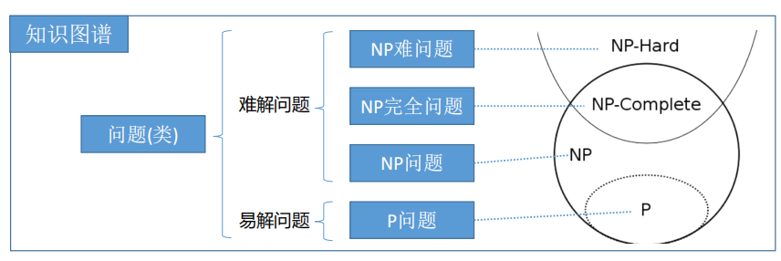
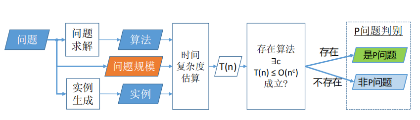
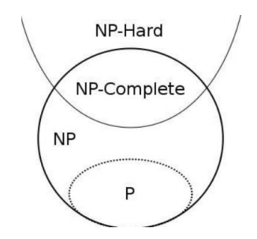
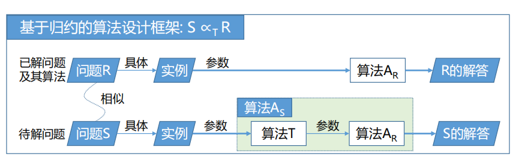

## 2.1算法分析体系及计量

算法分析的任务：对设计出的每一个具体的算法,利用数学工具，讨论其复杂度

### 2.1.1　算法分析的评价体系

#### 一、两大方面

1. 人对算法维护的方便性
2. 算法运行的时间与空间效率

#### 二、对算法分析和评价的标准

1. 算法实现耗费的时间
2. 算法实现耗费的存储空间，其中主要考虑辅助存储空间
3. 算法应易于理解，易于编码，易于调试等等

### 2.1.2　算法的时间复杂度

#### 一、和算法执行时间相关的因素

1. 问题中数据存储的数据结构
2. 算法采用的数学模型
3. 算法设计的策略
4. 问题的规模
5. 实现算法的程序设计语言
6. 编译算法产生的机器代码的质量
7. 计算机执行指令的速度

#### 二、衡量算法效率

1. 事后统计法（有缺点，较少使用）
2. 事前分析估计法

**==算法的时间效率是问题规模的函数==**

#### 三、时间复杂度估算

**算法的执行时间=Σ原操作的执行次数×原操作**

一个算法中所有语句的频度之和构成了该算法的运行时间。对较复杂的算法计算算法的运行时间,经常从算法中选取一种对于所研究的问题来说是基本(或者说是主要) 的原操作,**以该基本操作在算法中重复执行的次数作为算法运行时间的衡量准则**

==时间复杂度==：以该基本操作在算法中重复执行的次数作为算法运行时间的衡量准则：T(n)=O(n^2^)

其中**n为问题的规模**，实践表明可操作性最好的最具有实际价值的是最坏情况下的时间复杂性

### 2.1.3　算法的空间复杂度

##### 算法的存储量包括：

1. 输入数据所占空间
2. 算法本身所占空间
3. 辅助变量所占空间

若所需额外空间相对于输入数据量来说是常数，则称此算法为**原地工作**。否则它应当是规模的一个函数

==空间复杂度==：指算法在执行过程中所占辅助存储空间的大小, 用S(n)表示与算法的时间复杂度相同，算法的空间复杂度S(n)也可表示为:	S(n)=Ο(g(n))

### 2.1.4　NP完全性问题

NP完全性问题属于“计算复杂性”研究的课题。所谓计算复杂性，通俗说来，就是用计算机求解问题的难易程度。其度量标准：

1. 计算所需的步数或指令条数(这叫时间复杂度)。 
2. 计算所需的存储单元数量(这叫空间复杂度)。

**问题的复杂性是指这个问题本身的复杂程度**

#### 一、问题的复杂性

1. 计算复杂性研究计算机求解问题的难易程度
2. 计算复杂性研究不同复杂程度的问题类之间的联系

- 问题(类)按复杂性分为易解问题和难解问题。 
- 易解问题即P问题。 
- 难解问题中包括NP问题、NP难问题和NP完全问题等

#### 二、P(Polynomial)

**P问题**：可以有一个确定型图灵机在多项式时间内解决的问题

**非P问题**：

非确定性算法：非确定性算法将问题分解成**猜测**和**验证**两个阶段。算法的猜测阶段是非确定性的，算法的验证阶段是确定性的，它验证猜测阶段给出解的正确性。

#### 三、NP(Non-**deterministic** Polynomial)

**可以在多项式时间内判定解的正确性**

**猜测**阶段是非确定的，**验证**阶段是确定性的

时间开销评估**非确定性时间复杂度**，即**验证**阶段的**时间复杂度**

`NP-Hard`：NP问题可以**归约**到它

`NP-Complete`：NP问题，且NP-Hard问题

复杂性理论中最具理论意义的当数**NP完全性问题**，这类问题在下述意义下具有同等的难度：即要么每个NP完全问题都存在多项式时间的算法（即通常所指的有效算法）;要么所有NP完全问题都不存在多项式时间的算法。

#### 归约

将**待解问题**S基于算法T**归约**为**已解问题**R，并利用求解问题R的算法A~R~来设计算法A~S~，记作S ∝~T~R 

如果归约算法T可以在**多项式时间内运行**，则称S可多项式时间归约为R，记作S ≤~p~R

