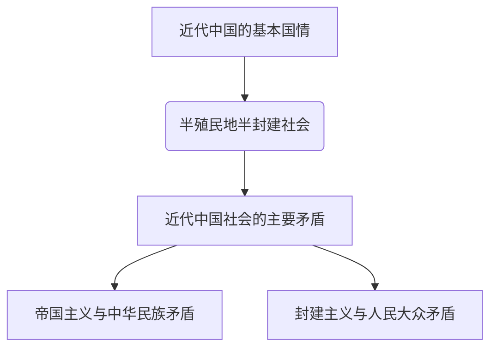
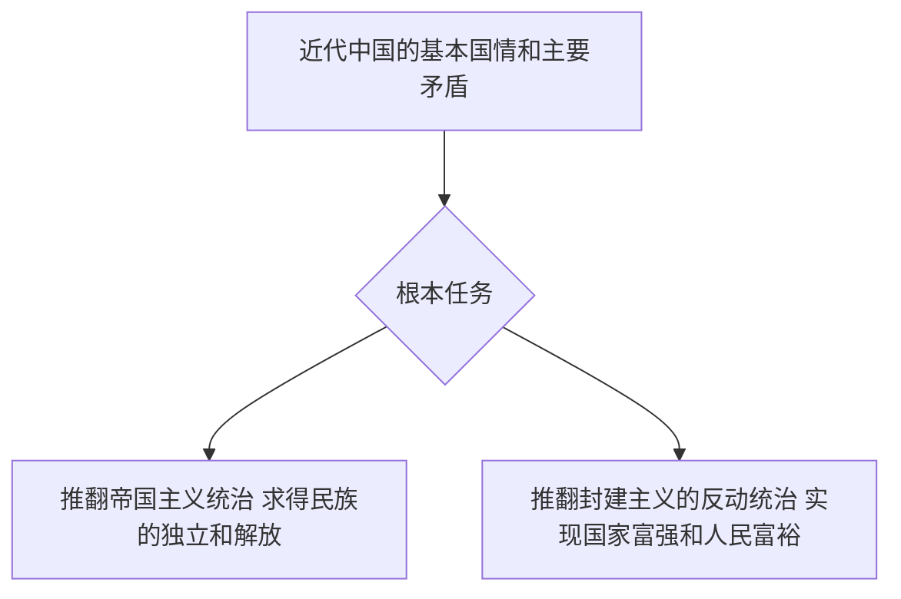

## 第一节 新民主主义革命理论形成的依据

### （一）近代中国国情和中国革命的时代特征

#### 1、近代中国国情

##### 鸦片战争前：

独立——主权独立

完整——领土完整

纯粹——生产关系纯粹

##### 鸦片战争后：

1840年鸦片战争后，中国社会发生了两个方面的变化：

一方面，外国资本主义的侵入，使中国沦为半殖民地国家。

另一方面，外国资本主义的侵入，使中国由一个完全的封建社会变为有了一定程度资本主义成份的半封建社会。

##### 近代中国社会性质：半殖民地半封建社会

半殖民：形式上有自己政府的国家，实际上在政治、经济等各方面都受到外国殖民主义的控制和奴役的社会形态。即丧失了部分主权而不是全部主权。

半封建：既保存了封建主义，又发展了资本主义。形式上仍是封建经济和自然经济占主导地位，实际上社会已经近代化，资本主义的经济、政治、思想文化因素在不断发展壮大，从一定程度上讲是历史的进步。

##### 近代中国社会基本特点

帝国主义——决定性力量决定性力量

封建势力——统治中国的社会基础（封建剥削同买办资本和高利贷资本的剥削相结合

民族资本主义——不是社会经济的主要形式

中国状况——长期不统一，发展极不平衡

人民群众——生活在水深火热之中

##### 近代中国社会的历史任务

#### 2、近代中国革命的时代特征

### （二）新民主主义革命理论的实践基础

#### 1、旧民主主义革命的失败呼唤新的革命理论

#### 2、新民主主义革命的艰辛探索奠定了革命理论形成的实践基础

## 第二节 新民主主义革命的总路线和基本纲领

## 第三节 新民主主义革命的道路和基本经验

