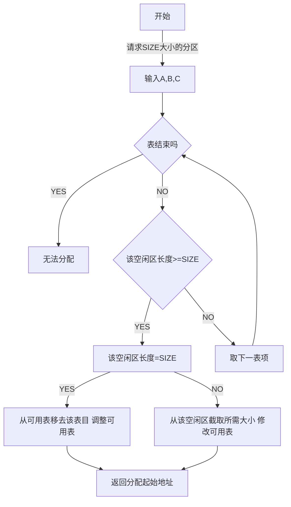

## 5.1存储管理的功能

### 5.1.1虚拟存储器

#### 虚拟地址（virtual address）

用户的程序经过汇编或编译后形成目标代码，目标代码通常采用**相对地址**的形式。这种相对地址即为虚拟地址 

#### 物理地址

内存中**存储单元的地址**。

#### 虚拟存储器

**将进程中的目标代码、数据等的虚拟地址组成的虚拟空间**

#### 基本原理

- 在程序装入时，不必将其全部读入到内存，而只需将当前需要执行的部分页或段读入到内存，就可让程序开始执行。
- 在程序执行过程中，如果需执行的指令或访问的数据尚未在内存（称为缺页或缺段），则由处理器通知操作系统将相应的页或段调入到内存，然后继续执行程序。
- 另一方面，操作系统将内存中暂时不使用的页或段调出保存在外存上，从而腾出空间存放将要装入的程序（页或段）――具有请求调入和置换功能，只需程序的一部分在内存就可执行；对于动态链接库也可以请求调入。

#### 好处

- 可在较小的内存中执行较大的用户程序 
- 可在内存中容纳更多程序并发执行 
- 不必考虑编程时的程序结构 
- 提供给用户可用的虚拟内存空间通常大于物理内存

### 5.1.2地址变换

#### 程序在成为进程前的准备工作： 

- 编辑：形成源文件(符号地址：用符号标记的地址，访问时需要映射为实际内存单位的地址) 

- 编译：形成目标模块(模块内符号地址解析) 

- 链接：多个目标模块或程序库生成可执行文件(模块间符号地址解析) 

- 装入：构造PCB，形成进程(使用物理地址) 

  ```mermaid
  graph LR
  	A[源程序] --> |编译链接|B[x]
      B --> |地址转换|C[物理存储器]
  	D[符号地址] --> |编译链接|E[数字地址]
      E --> |地址转换|F[绝对数字地址]
  ```

#### 地址映射（地址重定位）

将用户程序中的虚拟地址转换为运行时由机器直接寻址的物理地址

#### 实现的方法

##### 静态地址重定位(static address relocation)：

是在虚拟空间程序执行之前由装配程序完成地址映射工作。

**优点**：不需要硬件的支持

**缺点**：

- 使用静态重定位方法进行地址变换无法实现虚拟存储器。
- 必须占用连续的内存空间 
- 难以做到程序和数据的共享  

##### 动态地址重定位(Dynamic address relocation)：

是在程序执行过程中，在CPU访问内存之前，将要访问的程序或数据虚拟地址转换成内存物理地址。

**特点：**

- 依靠硬件地址机构完成
- 需要基地址寄存器BR和虚拟地址寄存器VR
- 物理内存地址MA=(BR)+(VR)


**优点：**

- 可以对内存进行非连续分配。 
- 动态重定位提供了实现虚拟存储器的基础。 
- 有利于程序段的共享

### 5.1.3 内外存数据传输的控制

要实现内存扩充，内存和外存之间必须经常地交换数据。方法有二：

##### 一、用户程序自己控制，如覆盖。

##### 二、操作系统控制

​	A、交换方式(整体)：由操作系统把那些在内存中处于等待状态的进程换出内存，而把那些等待事件已经发生、处于就绪态的进程换入内存

​	B、请求调入和预调入(页,段)

### 5.1.4 内存分配与回收

为有效合理利用内存，分配与回收方法要考虑和确定以下5种策略和数据结构：
**分配结构**：登记内存使用情况
**放置策略**：确定调入内存的程序和数据的位置
**交换策略**：确定哪些程序段或数据段能调出内存，以便腾出足够的空间
**调入策略**：外存中的程序段和数据段什么时间按什么样的控制方式进入内存。
**回收策略**：回收策略包括：一是回收的时机，二是对所回收的内存空闲区和已存在的内存空闲区的合并调整。

### 5.1.5 内存信息的共享与保护

<table><tr><td bgcolor=Cornsilk><b>共享</b>：节约内存。</br><b>保护</b>：当让每个进程能够可靠地进行，不受破坏。</td></tr></table>

- 在多道程序设计环境下，要限制各进程只在自己的存储区活动，**除了被允许共享的部分之外，各进程不能对别的进程的程序和数据段产生干扰和破坏**。因此须对内存中的程序和数据段采取保护措施

- 常用的内存信息保护方法有**硬件法**、**软件法**和**软硬件结合**3种方法。

#### 一、上下界保护法

**一种常用的硬件保护法：为进程设置了上下界寄存器，访问的地址不能超出上下界规定的范围**。若在规定的范围之内，则访问是合法的；否则是非法的，并产生访址越界中断。


#### 二、保护键法

​	给**存储块分配一个单独的保护键**。在程序状态字中则设置相应的保护键开关字段，==对不同的进程赋予不同的开关代码==以和被保护的存储块中的保护键匹配。
​    保护键可设置成：对读写同时保护（如2k—4k)或读、写单项保护(如4k—6k)。**如果==开关字与保护键匹配==，则访问该存储块是允许的，否则将产生访问出错中断。 **


#### 三、界限寄存器与CPU的用户态与核心态工作方式相结合的保护方式 

在这种保护模式下，**用户态进程只能访问那些在界限寄存器所规定范围内的内存部分，而核心态进程则可以访问整个内存地址空间。 **

## 5.2分区存储管理

### 5.2.1(进程整体)分区管理原理：

给每一个内存中的进程划分一块适当大小的存储区，以连续存储各进程的程序和数据，使各进程得以并发执行。

### 5.2.2分区管理分类：

#### 固定分区法

- 把内存区固定地划分为若干个大小不等的区域。分区一旦划分结束，在整个执行过程中每个分区的长度和内存的总分区个数将保持不变。

- 对内存的管理和控制通过数据结构——分区表进行。

  

  多出的空间：作业执行过程中会产生新的数据如中间数据、临时栈等，多出空间存放这些数据

```flow
st=>start: 要求Xk大小分区
op1=>operation: 取分区说明表第一项
op2=>operation: 置状态位”使用”
op3=>operation: 取下一表项
cond1=>condition: 表结束吗？
cond2=>condition: 该分区空闲吗？
cond3=>condition: 分区长度≥Xk
sub1=>subroutine: 无法分配
e=>end: 返回分号区

st->op1->cond1(no)->cond2(no)->op3->cond1
cond2(yes)->cond3(no)->op3->cond1
cond3(yes)->op2->e
cond1(yes)->sub1
```

#### 动态分区法

##### 基本思路：

在作业执行前并不直接建立分区，分区的建立是在作业的处理过程中进行的。且其大小可随作业或进程对内存的要求而改变。


##### 内存分配变化过程


##### 动态分区法数据结构

**可用表**：记录空闲区，包括区号，长度和起始地址

**自由链**：把空闲区组成链表，空闲区的头几个单元存放本空闲区的大小及下个空闲区的起始地址。

**请求表**：记录请求内存资源的作业或进程号和请求的内存大小


##### 动态分区时的分配与回收主要解决3个问题

- 根据请求表要求内存长度，分配程序从可用表或自由链中找出合适的空闲区。
- 分配空闲区之后，更新可用表或自由链。
- 进程或作业释放内存资源时，和相邻的空闲区进行链接合并，更新可用表或自由链。

##### 空闲区分配算法：

###### 最先适应法（first fit algorithm）

空闲区是按起始地址递增的次序排列



###### 最佳适应法（best fit algorithm）

该算法要求按空闲区大小从小到大的次序组成空闲区可用表或自由链。

###### 最坏适应法（worst fit algorithm）

该算法要求空闲区按其大小递减的顺序组成空闲区可用表或自由链。

##### 动态分区时的回收与拼接

将一个新空闲可用区插入可用表或队列时，该空闲区和上下相邻区的关系是下述4种关系之一：

- 该空闲区的上下两相邻分区都是空闲区
- 该空闲区的上相邻区是空闲区
- 该空闲区的下相邻区是空闲区
- 两相邻区都不是空闲区


## 5.3覆盖与交换技术

## 5.4页式管理

## 5.5段式与页式管理

## 5.6局部性原理和抖动问题

